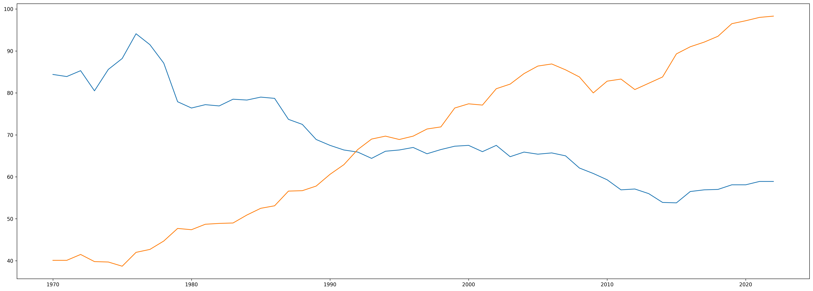
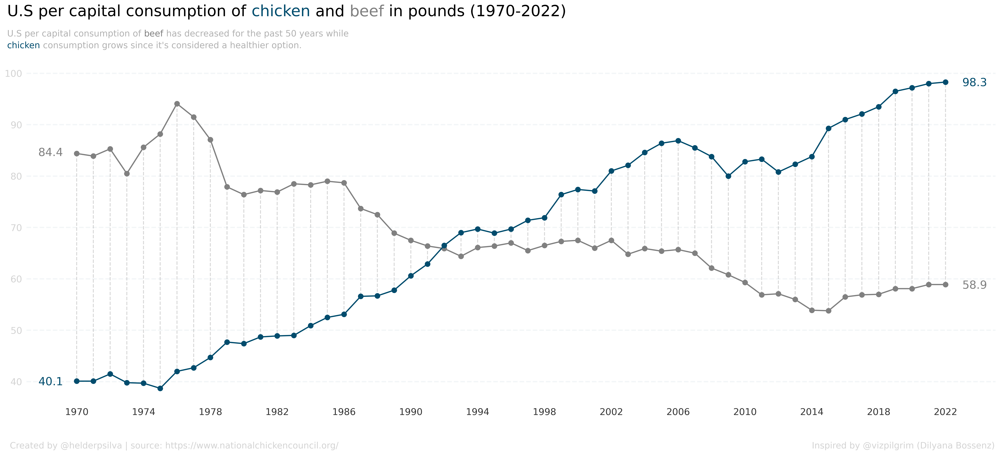
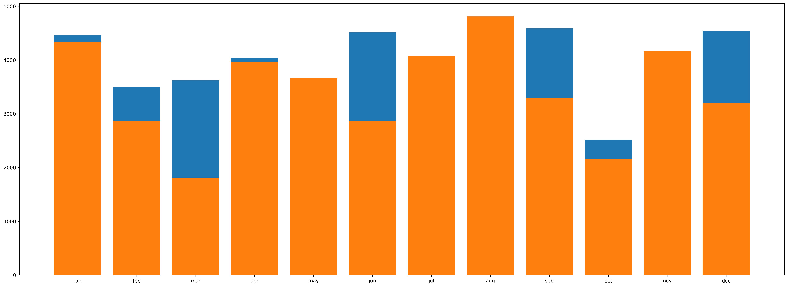
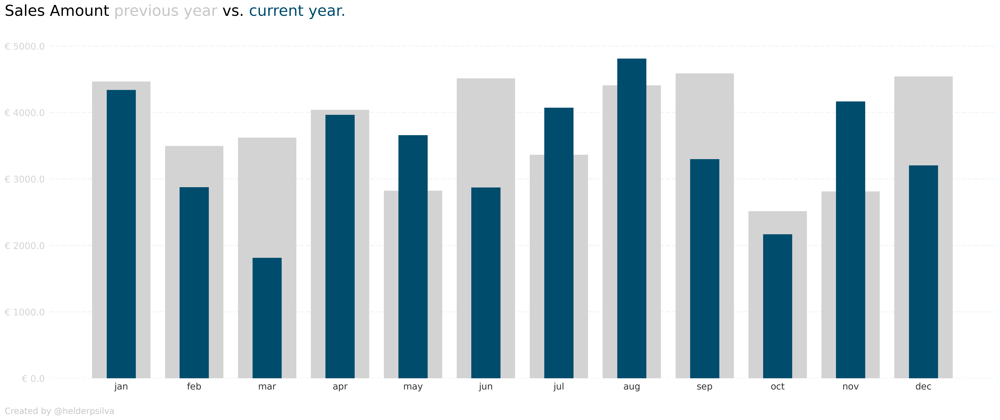

<h1 align="center">
  📈 Storytelling with Data (Matplotlib)
</h1>

  <a href="#-notebooks">Notebooks</a> •
  <a href="#-examples">Examples</a> •
  <a href="#credits">Credits</a>

### 📖 Notebooks
1. [**Line chart**](notebooks/line_chart.ipynb)
2. [**Bar chart**](notebooks/bar_chart.ipynb)
### ⚡ Examples

#### Line Plot

  

    

      
BEFORE

      
    

    

      
AFTER

       
    

  

#### Bar Plot

  

    

      
BEFORE

      
    

    

      
AFTER

       
    

  

### Credits
@vizpilgrim (Dilyana Bossenz) - Inspiration for the line chart.
